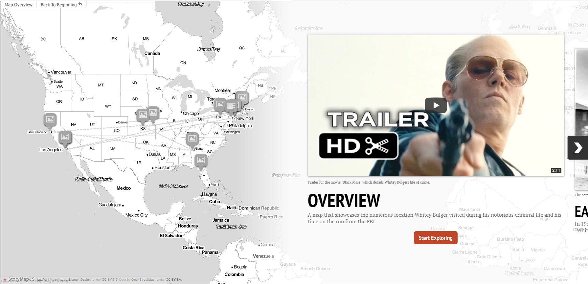
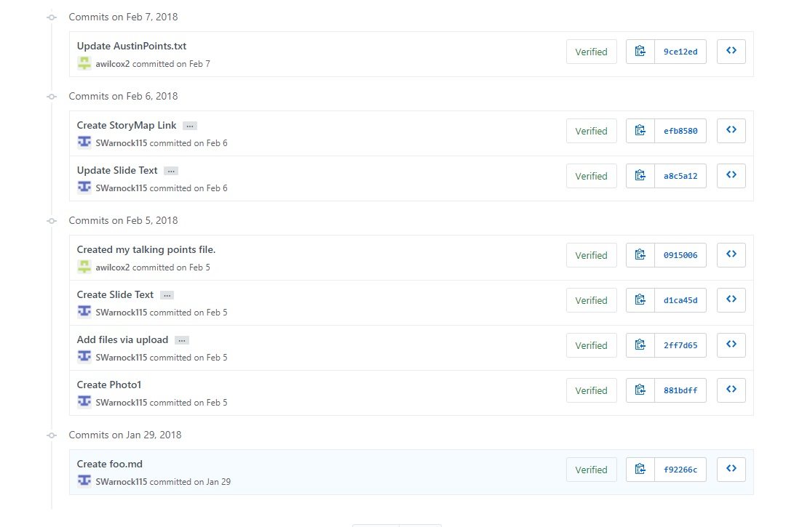

# IASC 2P02 Portfolio| Syd Warnock

## About Me

//

Hi and welcome to my Blog.
My name is Sydnee Warnock and I am a fourth year Brock student hoping to complete a major in Interactive Arts and Science, or IASC for short. I hope to gain a collection of unique skills that will help me better understand digital humanities and further my knowledge in it. My research focus is media archaeology and how it relates to old and obsolete game systems. I want to learn how this old tech has influenced today's trends, some alternative paths game systems could have taken, as well as how some of the old tech is being riased from the grave to experience a new life. This focus can be seen in my featured project, which focuses on the failed game system Virtual Boy, which was released by Nintendo in 1995. In the presentation I discussed its shortlived history, its development, and the struggles it faced. I also looked at how it relates to zombie tech, alternative history as well as the idea of zxombie tech as it relates to the Virtual Boy. In the future I hope to use this knowledge to further my career with the knowledge of past trends and hope to predict future trends to ensure success.  

## Feature Project: Research Presentation (Virtual Boy)

For my research presentation I had to present an old form of technology in Pecha Kucha style. Since I always enjoy learning about old game systems, I chose one of the more well-known failures in the Virtual Boy, which was created by Nintnedo and released to critical and commercial failure in 1995. This falure interested me for two reasons. The first is that Nintendo is well-known for being successful and the Virtual Boy is one of the first time they failed to hit the mark. The second reason is that it was one of the first attempts at creating a virtual reality console. For years before, and after, the realease of the console, consumers have seen virtual reality as the next big step in media. The ability to be fully immersed in something is an anchanting thought and what media companies have been searching for for years..For the presentatiopn I focused on the commercial history of the device, the features, and what exactly made it fail. At the end of the presentation I looked at how the console relates to the idea of media archaeology. I believe that learning about the failure of the Virtual Boy is important for Digital Humanities and IASC students as it can teach students that despite the demand for newness not every attempt will be successful and the need to learn from past mistakes. The Virtual Boy shows how comfort and looks are still paramount to the success of something and without those you are destined for failure.

Over time I have edited and changed to Pecha Kucha based on the feedback I received after I presented. The main focus of my edits related to media archaeology and how the Virtual Boy applied to it. This is because the main point of criticism is that I did not focus enough of my presentation on it. As such I set out to fix this. I did by adding 5 slides, all of which focused on media archaeology . 

Read about the Virtual Boy [here](https://swarnock115.github.io/2P02-Portfolio/reveal.js-master/index.html).

## Collaborative Project

For the collaborative project, I and three others researched the online mapping tool StoryMap JS. The main purpose of this tool is to tell a story by mapping key locations in a story, be it fiction or real. To highlight the use of the tools I created a Storymap that highlighted the events of Whitey Bulger, a notorious American gangster. Our reseach found that the tool was simple to use but was limited by the users knowledge. It also has difficulties in mapping a story that jumps across the map as it creates a confusing mess of lines and points. Overall the tool is simple to use and is good for anyone looking to map out a linear story. 

When collaborating with others for a project I find it important to make group decisions at the very beginning. By doing this we should be able to set a good framework for the rest of the collaboration as well as answer any pertinent question. In this case that group decision was what tool would we be reasearching. We quickly decided that StoryMap JS looked interesting and had a lot to offer us. After that decision was made we split the worload between the four of us. I was responsible for producing something using StoryMap JS, which can be found [here](https://docs.google.com/presentation/d/1TpvivMS9DSkUCglqKD3MxSgffAC6iVZGAQptY_OEvdc/edit#slide=id.p5). To ensure this project was easty to accomplish we utlized GtitHub which allowed us to upload and share our work with ease. The list of commits can be found here [here](https://github.com/IascAtBrock/IASC-2P02-TeamPresentations/commits/Team6). Overall this collaboration was simple as each individual was responsible for their own parts and were competent enough tocomplete their assignments on time. A benefit of working in a group setting is that you can utilize the different skills each person brings to create an excellent project. For the digital Humanties collaboration is important as it ensures that we are not stuck in an echo chamber, we are able to hear each persons ideas and thoughts, and hopefully further our understanding of the topic and tools we are using in the future.

Below is an image of the progress that was made in the Reaserach Finding section of the assignment.

## Academic Blog
The Digital Humanities is in a weird situation. [Continue Reading](blog.md)

